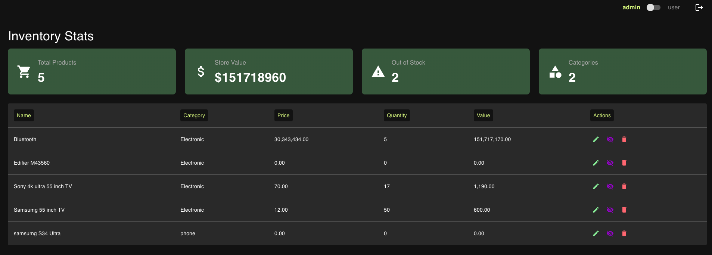

# Inventory Management App

A React-based inventory stats application built as part of a coding challenge for Lucidity. This app allows admins to manage inventory and users to view inventory in a read-only mode.

## Demo

The application is live and can be accessed at:
[Lucidity Inventory Stats App](https://lucidity-assignment-eight.vercel.app/)



---

## Features

### Admin View

- View all products in a table.
- **Edit Products**: Update product price and quantity via a modal. Value is auto caluclated from it.
- **Delete Products**: Remove products from the inventory.
- **Disable Products**: Mark products as disabled (row grayed out, actions disabled).
- Stats of inventory metrics:
  - **Total Products**
  - **Total Store Value**
  - **Out-of-Stock Products**
  - **Number of Categories**

### User View

- Read-only access to inventory.
- All action buttons are disabled.

### Error State:

- If the API request fails, an error message is displayed.

### Loading State:

- If the API request is in progress, a loading message is displayed.

---

## Tech Stack

- **Frontend Framework**: [React](https://reactjs.org/)
- **Build Tool**: [Vite](https://vitejs.dev/)
- **Language**: TypeScript
- **State Management**: Redux Toolkit
- **UI Library**: Material UI
- **Hosting**: Vercel

---

### Prerequisites

Ensure you have the following installed:

- Node.js (v14 or higher)
- npm or yarn

### Steps to Run Locally

1. Clone the repository:
   ```bash
   git clone https://github.com/your-username/lucidity-assignment.git
   cd lucidity-assignment
   ```
2. Install dependencies:
   ```bash
   npm install
   ```
3. Start the development server:
   ```bash
   npm run dev
   ```
4. Open your browser and navigate to:
   ```
   http://localhost:5173
   ```

---

## API Reference

The app fetches inventory data from the following endpoint:

- **Endpoint**: `https://dev-0tf0hinghgjl39z.api.raw-labs.com/inventory`
- **Method**: `GET`
- Please do not refresh as `429: Too many requests error` will be thrown.

---

## Deployment

The app is deployed on **Vercel**. Visit the live version here:
[https://lucidity-assignment-eight.vercel.app/](https://lucidity-assignment-eight.vercel.app/)
